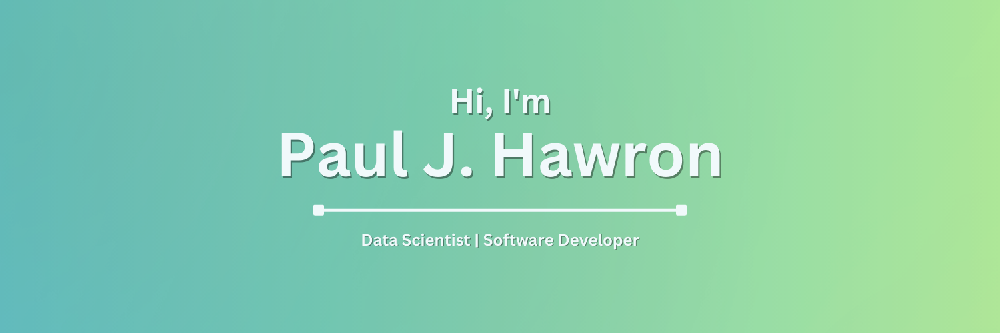

 

## 👋 About Me

I'm Paul, a data scientist and software developer who loves learning about everything from sports analytics to blockchain development. Welcome to my GitHub page, full of miscellaneous projects that I've put some time into over the years. 

If you want to learn more about my professional journey, check out my [LinkedIn](https://www.linkedin.com/in/pauljhawron/).

## 📒 My Projects

Here are some of my repos and projects in a more organized way.

### Data Projects

- [NBA Trends EDA](https://github.com/pauljhawron/nba-trends-eda) | An Exploratory Data Analysis of NBA trends with Python.
- [NBA Team Success Analyses](https://github.com/pauljhawron/nba-team-success-analyses) | An ML project categorizing NBA team success and player valuations using SAS Viya. 
- [Rumble Kong League (RKL) Boost Analysis](https://github.com/pauljhawron/rkl-boost-analysis/blob/master/rkl_boost_analysis.ipynb) | An analysis of RKL NFT sales based on their attributes using Python.

### Web3 Projects

- [Solana NFT Mint Site](https://github.com/pauljhawron/the-whitelist-project) | A simple NFT mint site that integrates with the Solana blockchain via JavaScript connectors.

### Miscellaneous

- [Solana API Test](https://github.com/pauljhawron/solana-api-test) | Experimenting with various Solana-based APIs in Python to brainstorm project ideas.
- 

## 📊 My Stats

